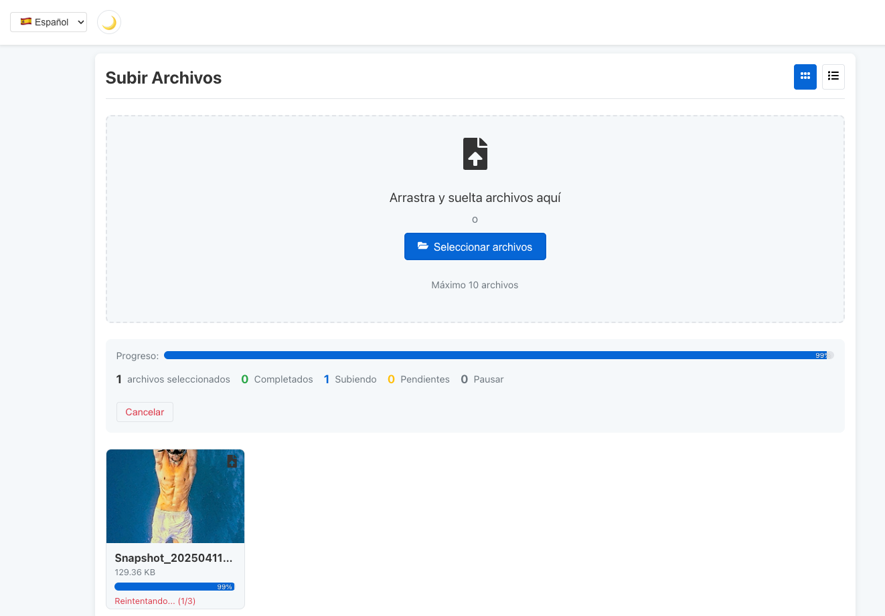
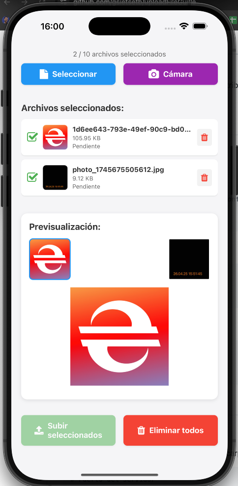

# Sistema de Carga de Archivos

Un sistema completo para la carga de archivos de gran tamaño con soporte para múltiples plataformas: web y móvil.

## 🚀 Características

### Backend (Node.js + Express + TypeScript)
- ✅ Carga en fragmentos (chunks) para archivos grandes
- ✅ Detección de tipo de archivo por magic numbers
- ✅ Deduplicación usando hashes MD5
- ✅ Limpieza automática de archivos temporales
- ✅ APIs RESTful completas:
  - Inicialización de carga
  - Carga de fragmentos
  - Finalización y ensamblado
  - Gestión de estado (pausa/reanudación)
  - Cancelación
- ✅ Validación y limitación de tamaño/tipo
- ✅ Rate limiting para prevenir abusos
- ✅ Soporte para Redis (opcional)
- ✅ Logs detallados con Winston

### Cliente Web (React + TypeScript)
- ✅ Carga de imágenes, vídeos y otros tipos de archivos
- ✅ Validación instantánea de archivos
- ✅ Previsualización visual de archivos
- ✅ Barras de progreso detalladas
- ✅ Funcionalidad para cancelar/pausar/reanudar cargas
- ✅ Gestión de errores y reintentos automáticos
- ✅ Carga concurrente de múltiples archivos
- ⏳ Drag-and-drop (en desarrollo)
- ⏳ Almacenamiento local para historial de cargas (en desarrollo)

### Cliente Móvil (React Native + Expo)
- ✅ Carga de archivos desde galería
- ✅ Captura de fotos con cámara integrada
- ✅ Interfaz adaptada para iOS y Android
- ✅ Gestión de permisos de dispositivo
- ✅ Barras de progreso y notificaciones
- ✅ Gestión de conexión al servidor
- ✅ Carga concurrente de múltiples archivos
- ⏳ Carga en segundo plano (en desarrollo)



### Testing
- ✅ Tests unitarios para componentes críticos
- ✅ Tests de integración para el flujo de carga
- ✅ Mocks para dependencias externas
- ✅ Alta cobertura en el backend
- ⏳ Tests end-to-end (en desarrollo)
- ⏳ Stress testing (en desarrollo)

## 📋 Requisitos previos

- Node.js v14+
- npm o yarn
- Redis (opcional, para almacenamiento distribuido)
- Expo CLI (para desarrollo móvil)

## 🛠️ Instalación

### Backend

```bash
cd server
npm install
cp .env.example .env  # Editar con tu configuración
npm run build
npm start
```

### Cliente Web

```bash
cd client/web
npm install
npm start
```

### Cliente Móvil

```bash
cd client/mobile/mobile-uploader
npm install
npx expo start
```

## ⚙️ Configuración

### Variables de Entorno (.env)

Copia el archivo `.env.example` a `.env` en la carpeta del servidor y ajusta los valores:

```
# Puerto del servidor
PORT=3001

# Configuración de Redis (opcional)
REDIS_ENABLED=false
REDIS_HOST=localhost
REDIS_PORT=6379

# Límites de carga
MAX_FILE_SIZE=100000000  # 100MB
CHUNK_RETENTION_MINUTES=60
FILE_RETENTION_DAYS=30

# Tipos de archivos permitidos
ALLOWED_MIME_TYPES=image/jpeg,image/png,image/gif,video/mp4,application/pdf

# Rate limiting
UPLOAD_RATE_LIMIT_POINTS=100
UPLOAD_RATE_LIMIT_DURATION=60
```

### Configuración del Cliente Móvil

Ajusta la URL del servidor en `client/mobile/mobile-uploader/src/components/FileUploader.tsx`:

```typescript
const DEFAULT_IP = '192.168.1.144';  // Cambia a la IP de tu servidor
const DEFAULT_PORT = '3001';
```

## 📱 Uso del Cliente Móvil

1. Inicia el servidor backend
2. Actualiza la IP del servidor en la configuración móvil
3. Inicia la aplicación móvil con `npx expo start`
4. Selecciona archivos desde la galería o toma fotos con la cámara
5. Sube los archivos seleccionados

## 🌐 Uso del Cliente Web

1. Inicia el servidor backend
2. Inicia la aplicación web con `npm start`
3. Navega a `http://localhost:3000`
4. Selecciona archivos para subir
5. Gestiona las cargas con las opciones de pausa/reanudación/cancelación

## 🧪 Pruebas

```bash
cd server
npm test
```

## 📈 Mejoras Futuras

- Implementación de drag-and-drop en cliente web
- Almacenamiento local para historial de cargas
- Carga en segundo plano en la aplicación móvil
- Tests end-to-end y stress testing
- Sincronización entre dispositivos
- Encriptación de archivos
- Autenticación de usuarios

## 📄 Licencia

Este proyecto está bajo la Licencia MIT - ver el archivo [LICENSE](LICENSE) para más detalles. 